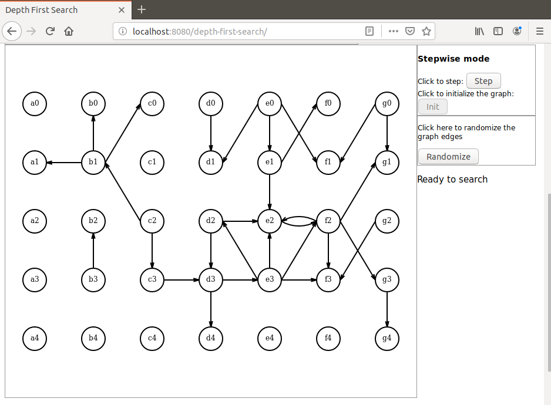
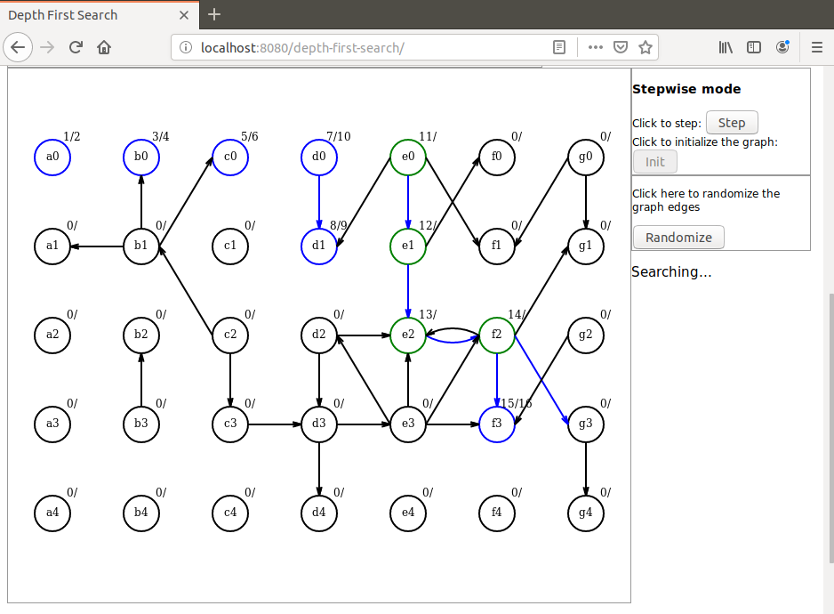
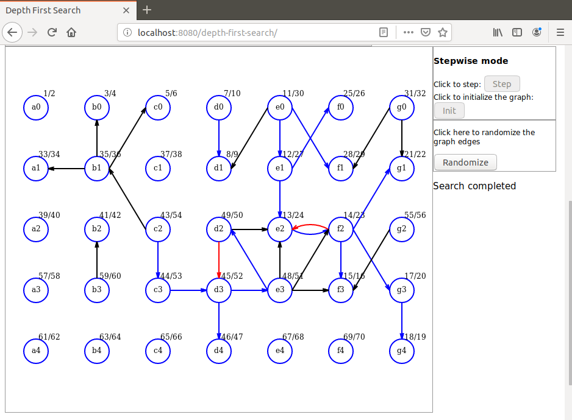

# depth-first-search-step
I present here a Java based demonstration of the Depth First Search algorithm. 

The algorithm itself is implemented in Java. Javascript is used for initialization and display only. 

The search itself is step-by-step, each Ajax request resulting in a new vertex discovery executed on server side.

When the search is completed all edges are colored according to the DFS edge classification:

Blue for Tree edges
Green for Forward edges
Red for Backward edges
Black for Cross edges
 
# Launching the demo
To launch the demo run the command `mvn spring-boot:run` in project directory. When the application has started open a browser and hit URL `localhost:8080/depth-first-search`.

Here are some screen shots that can be seen during the demo:

Graph initialized

For an animated version of this algorithm please visit this repository:

https://github.com/dubersfeld/depth-first-search-anim 

Dominique Ubersfeld, Cachan, France
